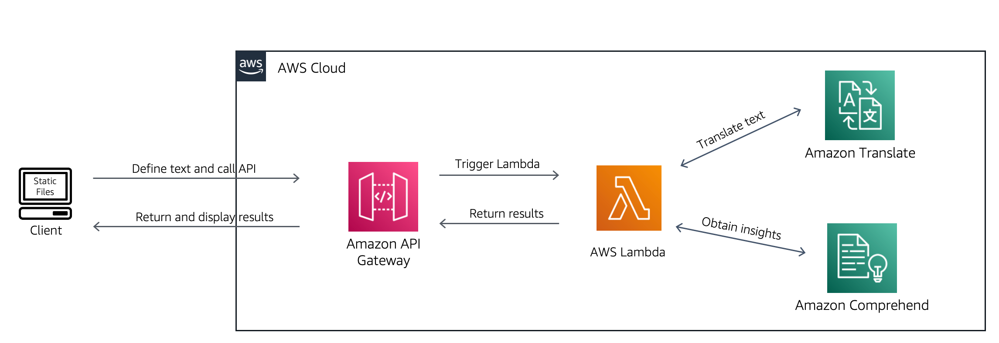
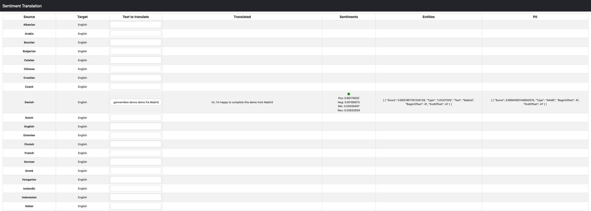

### Why am I here? 
Welcome to the Translate Sentiments Demo. As you may or may not know, you can use Amazon Translate to translate text and files, and Amazon Comprehend to obtain insights from text. Amazon Comprehend is currently available for the [following languages](https://docs.aws.amazon.com/comprehend/latest/dg/supported-languages.html), and you may want to extract information from a non supported language. The objective of this demo is for you to combine both services and obtain insights from any language supported by Amazon Translate. 

### Why do I need?

* **Web Browser** I imagine you already have one if you are reading this.  
* **AWS Account** If you don't already have an account or you have not been handed one as part of a workshop, please visit the following [link](https://aws.amazon.com/es/free)! 
* **Text editor** Don't worry if you are not a Coding Guru, I promise setting the demo up will be very easy!

### What am I going to build?

As mentioned before, the objective is for you to test Amazon Translate and Amazon Comprehend together, so for this reason you are going to deploy all the infrastructure needed automatically with an AWS CloudFormation template already created. 

#### I want to run the webapp locally on my computer!

If you choose to deploy this semi-automated infrastructure, Amazon API Gateway and AWS Lambda (with the appropriate role to call Amazon Polly) will be deployed and configured. You will also have to open the static assets locally on your computer and make a small change in the code which I will specify you later.

* **Step 1:** Deploy the AWS Infrastructure:
  * [Launch](https://eu-west-1.console.aws.amazon.com/cloudformation/home?region=eu-west-1#/stacks/create/review?templateURL=https://aidemos-translatesentiments.s3.eu-west-1.amazonaws.com/translatesentiments-local.yaml&stackName=Translate-Sentiments-Demo) the following **AWS CloudFormation Template** in your account (The link will automatically open the AWS CloudFormation console).
  >__Note:__ If you are already running this CloudFormation Stack with the predefined Stack Name, please change the name of the new stack.
  * All parameters are already configured so just select your Stack Name, check the AWS CloudFormation acknowledgements and click Create stack.
  * Wait until the stack goes into the **CREATE_COMPLETE** status, then go to the **Outputs tab**.
  * You will see an output named **ApiEndpoint**. Take note of the url, as you will use it later. 

* **Step 2:** Download the necessary static files to run the webapp and configure the API call.
    * [Download](https://aidemos-translatesentiments.s3.eu-west-1.amazonaws.com/transalatesentiments-local-assets.zip) the following .zip file and decompress it!
    * Open the **api-gateway-endpoint.js** located in the **js** folder and insert the API url from the previous step in the first line, where you will see the follwing code:
    
      ``const apiEndpoint='REPLACE-THIS-WITH-THE-API-ENDPOINT';`` 
    
* **Step 3:** You are now ready to run index.html on your local server and start testing the translations.
  * How do I create a local server? -> Navigate to the assets folder with ``cd PathToYourAssetsFolder``and run the following command ``python -m SimpleHTTPServer``. Next, just head to your browser and type in ``localhost:8000``and you should see the Translate Sentiments Panel.

### What should I be seeing?

If you followed correctly the previous steps you should be able to see the Translate Sentiments Panel.

