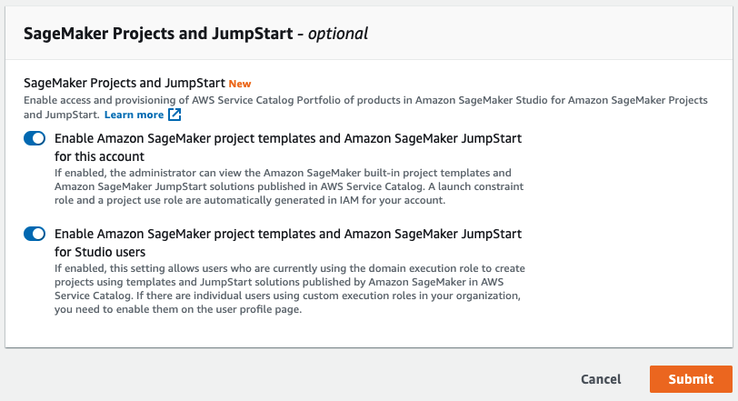
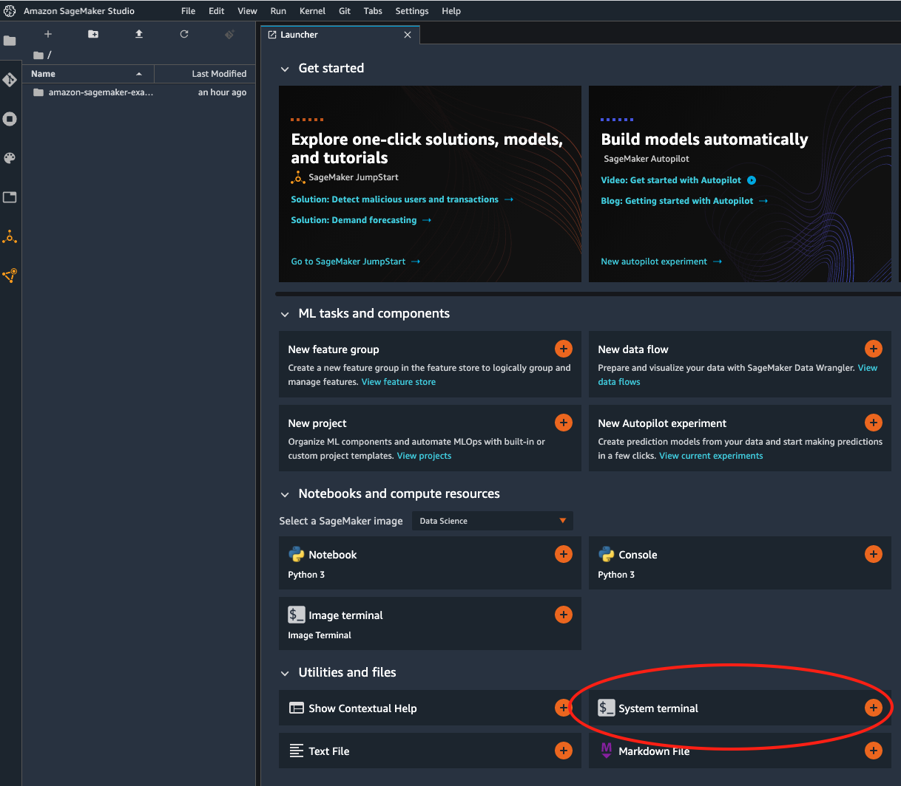
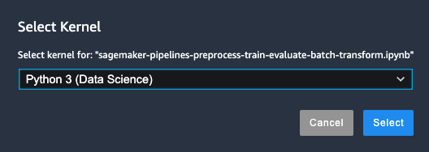
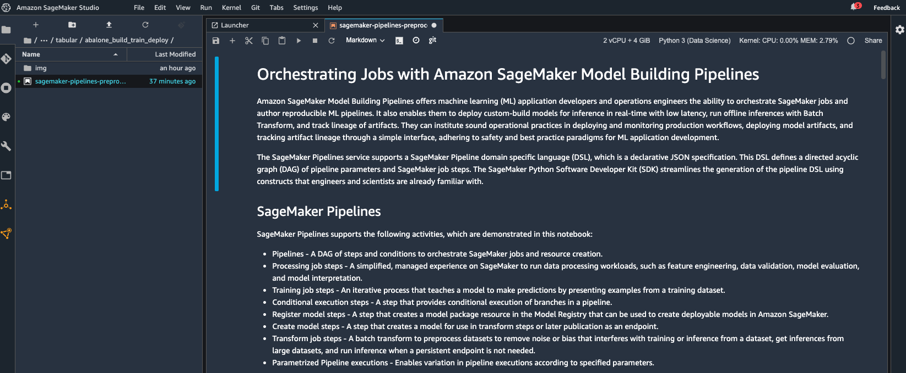

# Orchestrating model building jobs with Amazon SageMaker Pipelines

In this lab, we will explore the feature that allow us to build, manage, and execute ML pipelines following MLOps best practices.

Amazon SageMaker Pipelines offers machine learning (ML) application developers and operations engineers the ability to orchestrate SageMaker jobs and author reproducible ML processing, tuning, and training pipelines. It also enables them to deploy built-in or custom-build models for inference in real-time with low latency, run offline inferences with Batch Transform, and track lineage of artifacts.

Amazon SageMaker Pripelines can be used either from the graphical UI in Amazon Studio, or programatically through with the SageMaker Python SDK. In this lab, we will use a notebook for creating a pipeline programatically that will: pre-process, train, evaluate, create a model, register it, and running a batch transformation. We will still rely on SageMaker Studio for running the notebook, and allowing us to check the UI for the project later.

-----------------

## **Opening Amazon SageMaker Studio**

For this lab we will use the integrated IDE for ML, called **Amazon SageMaker Studio**, with the following steps:
* Open the AWS Console for your account.
* Look for Amazon SageMaker and [click on it](https://eu-west-1.console.aws.amazon.com/sagemaker/home?region=eu-west-1#/landing).
* Choose *Amazon SageMaker Studio* at the top left of the page.


* In this lab we will use SageMaker Projects for organizing our pipelines, so we need to enable this feature first for our account. For this, go to "Edit Settings" in the right side of the screen


* Then enable the two settings for project templates in the account and your Studio user, and click "Submit"



* Now, look for "Open Studio" in the right side of the screen and click on it. The Amazon SageMaker Studio loading page displays. When Studio opens you can start using it. 

**Note: this can take a few mins the first time you open it**


## **Cloning the example repository and running the notebooks for the end-to-end lab**

Now that your SageMaker Studio is open, you will get the notebook that we will be using and follow the steps on it:
* If not open already, create a new Studio Launcher tab by going to "File"->"New Launcher".



* Click on **"System Terminal"** to open a new terminal tab (do not confuse with "Image terminal").
* Copy-paste the following command in the terminal and hit enter. This will clone the [Amazon SageMaker Examples GitHub repository](https://github.com/aws/amazon-sagemaker-examples/) to your Studio local environment.
    ```
    git clone https://github.com/aws/amazon-sagemaker-examples/
    ```


* In the left menu you should see the **"File Browser"** tab (the folder icon at the top-left).
* Double click in the new folder: ***"amazon-sagemaker-examples"***
* Double click the folder: ***"sagemaker-pipelines"***
* Double click the folder: ***"tabular"***
* Double click the folder: ***"abalone_build_train_deploy"***
* Finally, double click the notebook file called: ***"sagemaker-pipelines-preprocess-train-evaluate-batch-transform.ipynb"***. The notebook will open on a new tab.
* In the select kernel pop-up, select "Python (Data Science)".



* Now **read** and follow the cells in the notebook one by one.
    > If you are new to Jupyter notebooks, you can run the notebook document step-by-step (one cell a time) by pressing "shift" + "enter". Note:
    > * While a cell is running it will show an asterix "*" next to it
    > * When the cell execution completes it will show the execution number

The notebook will guide you through the process. When indicated proceed to the next notebook.



You can also check a blog post explaining how to use Amazon SageMaker Pipelines from the graphical UI in Studio:

https://aws.amazon.com/es/blogs/aws/amazon-sagemaker-pipelines-brings-devops-to-machine-learning-projects/

Thank you!
